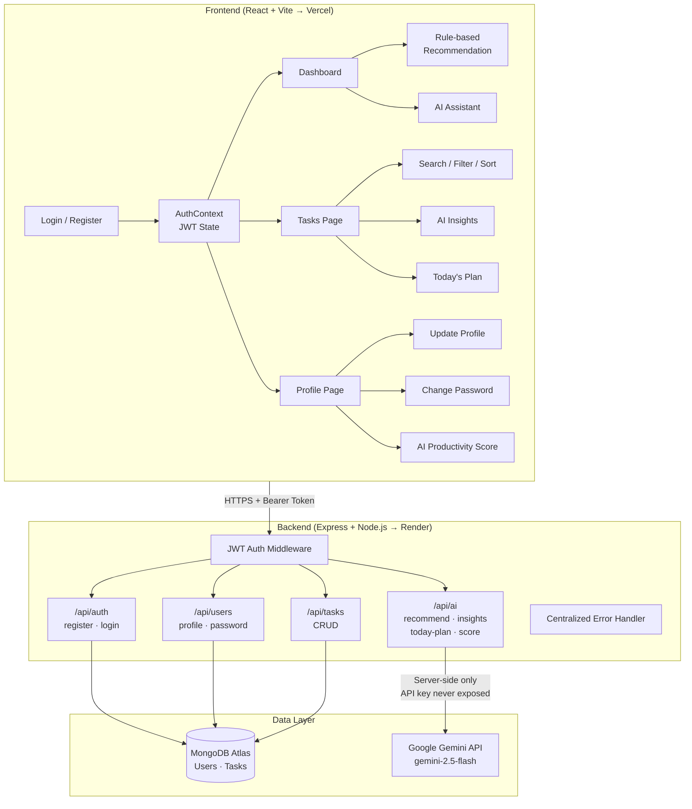

# AI-Powered Smart Productivity System

> A full-stack MERN task management platform with AI-driven prioritization — built for anyone with too much to do, not just students.

**Live Demo:** https://ai-powered-smart-productivity-syste.vercel.app  
**GitHub:** https://github.com/Siddiqua2007/ai-powered-smart-productivity-system

---

## What This Is

Most productivity apps assume you're either a student or an office worker. This one works for anyone — students, doctors, engineers, lawyers, freelancers — because categories are fully custom (type "Patients," "Court Filing," "Gym," anything), and the AI layer is designed to be calm and encouraging, not another source of pressure.

---

## Architecture



---

## Features

- **Secure authentication** — JWT-based login/register, bcrypt password hashing, protected routes on both API and frontend
- **Full task CRUD** — create, edit, delete, mark complete, with priority, deadline, and fully custom categories
- **Search, filter, and sort** — by keyword, category, priority, or status; sort by deadline, priority, or newest
- **Four AI features powered by Google Gemini:**
  - Smart task recommendation — tells you the single most important task to do *right now*, with reasoning
  - Today's Plan — a realistic, ordered plan for your day based on your real pending tasks
  - Productivity Insights — a warm, honest summary of how you're doing
  - Productivity Score — a 0-100 score with explanation, based on your full task history
- **Account management** — update name/email, change password, all reflected instantly across the app
- **Custom design system** — warm palette, serif headings, distinct AI card styling; no UI library used

---

## Tech Stack

| Layer | Technology |
|---|---|
| Frontend | React 19, Vite, React Router, Axios |
| Backend | Node.js, Express |
| Database | MongoDB Atlas, Mongoose |
| AI | Google Gemini API (`gemini-2.5-flash`) |
| Auth | JSON Web Tokens (JWT), bcrypt |
| Deployment | Vercel (frontend), Render (backend), MongoDB Atlas |

---

## Key Engineering Decisions

**Gemini API key stays server-side only.** All AI calls go through `/api/ai/*` backend routes. Anything in frontend code gets bundled into public JavaScript — so an API key there would be visible to anyone who opens DevTools. Calling Gemini through the backend keeps the key safe and is the architecturally correct pattern.

**Custom categories instead of a hardcoded list.** Early versions had `['DSA', 'Academics', 'Internship', 'Personal']` — only useful for CS students. The schema was refactored to accept any free-text string, with the frontend generating suggestions dynamically from whatever categories the user has already used. This is what makes the app genuinely usable by anyone.

**Retry logic for Gemini 503 errors.** The free-tier Gemini model occasionally returns "overloaded" errors under load. The `askGemini()` helper retries up to 2 times with exponential backoff (1.5s, then 3s) specifically for 503s, and fails immediately on any other error type.

---

## Project Structure

```
ai-powered-smart-productivity-system/
├── backend/
│   ├── config/db.js              # MongoDB connection
│   ├── controllers/
│   │   ├── userController.js     # register, login, profile, password
│   │   ├── taskController.js     # CRUD operations
│   │   └── aiController.js       # Gemini API calls (4 features)
│   ├── middleware/
│   │   ├── authMiddleware.js     # JWT verification
│   │   └── errorHandler.js       # Centralized error handling
│   ├── models/
│   │   ├── User.js               # bcrypt pre-save hook
│   │   └── Task.js               # Free-text category field
│   ├── routes/
│   │   ├── authRoutes.js
│   │   ├── userRoutes.js
│   │   ├── taskRoutes.js
│   │   └── aiRoutes.js
│   ├── server.js
│   └── .env.example
└── frontend/
    ├── src/
    │   ├── components/           # Navbar, Sidebar, Layout, ProtectedRoute
    │   ├── context/              # AuthContext — global JWT + user state
    │   ├── pages/                # Login, Register, Dashboard, Tasks, Profile
    │   └── services/             # Axios wrappers for all API calls
    ├── index.css                 # Custom design system (CSS variables)
    └── .env.example
```

---

## API Reference

| Method | Endpoint | Auth | Description |
|---|---|---|---|
| POST | `/api/auth/register` | No | Create account |
| POST | `/api/auth/login` | No | Login, returns JWT |
| GET | `/api/users/profile` | Yes | Get logged-in user |
| PUT | `/api/users/profile` | Yes | Update name/email |
| PUT | `/api/users/change-password` | Yes | Change password |
| POST | `/api/tasks` | Yes | Create task |
| GET | `/api/tasks` | Yes | Get all your tasks |
| PUT | `/api/tasks/:id` | Yes | Update / mark complete |
| DELETE | `/api/tasks/:id` | Yes | Delete task |
| POST | `/api/ai/recommend` | Yes | AI: best next task |
| POST | `/api/ai/today-plan` | Yes | AI: daily plan |
| POST | `/api/ai/insights` | Yes | AI: progress summary |
| POST | `/api/ai/productivity-score` | Yes | AI: 0-100 score |

Protected routes require `Authorization: Bearer <token>` header.

---

## Getting Started

### Prerequisites
- Node.js 18+
- Free [MongoDB Atlas](https://www.mongodb.com/atlas) cluster
- Free [Google Gemini API key](https://aistudio.google.com/apikey)

### Backend
```bash
cd backend
npm install
cp .env.example .env
# Fill in MONGO_URI, JWT_SECRET, GEMINI_API_KEY, CLIENT_URL
npm run dev
```

### Frontend
```bash
cd frontend
npm install
cp .env.example .env
# Set VITE_API_URL=http://localhost:5000/api
npm run dev
```

Open `http://localhost:5173`

---

## Deployment

| Service | What it hosts | Key env vars |
|---|---|---|
| MongoDB Atlas | Database | — |
| Render | Backend API | `MONGO_URI` `JWT_SECRET` `GEMINI_API_KEY` `CLIENT_URL` |
| Vercel | Frontend | `VITE_API_URL` |

---

## What I Learned

- Building JWT auth from scratch and understanding why writing a token to `localStorage` directly (bypassing React Context) silently breaks the entire auth flow
- Why case-sensitive file imports (`sidebar.jsx` vs `Sidebar.jsx`) are invisible bugs on Windows/Mac but guaranteed crashes on Linux deployment servers
- Designing flexible data models — free-text categories instead of a hardcoded enum — so the app works for any type of user
- Calling an LLM API safely from a backend, with retry logic for transient model overload errors
- That CORS errors in production are almost always environment variable mismatches, not code bugs

---

## License

Educational and portfolio use.
